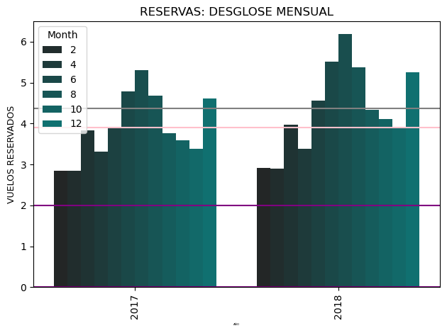
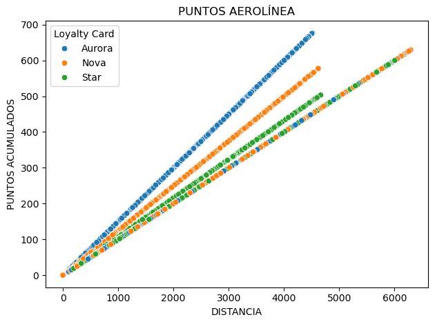
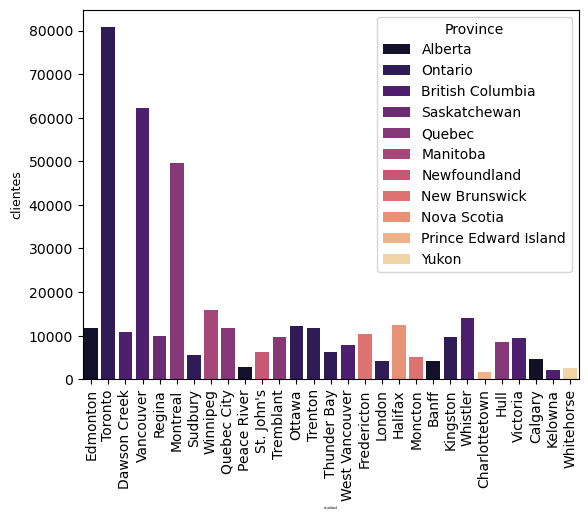
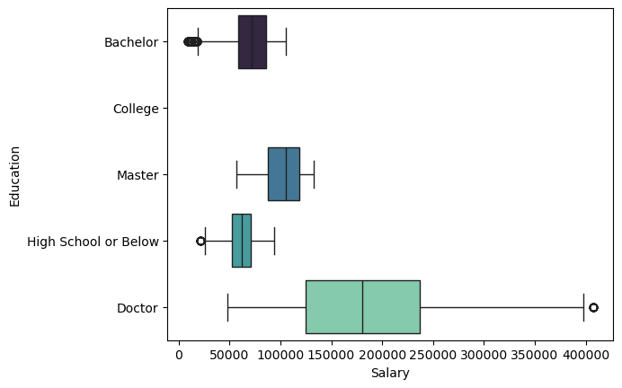
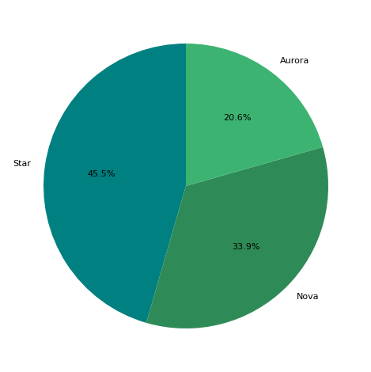
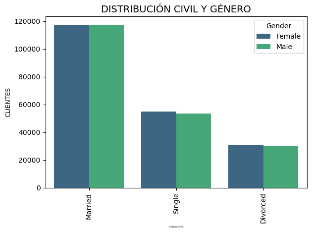

# ✈️ EVALUACIÓN FINAL MÓDULO 3: TRANSFORMACIÓN DE DATOS

Este repositorio contiene el ejercicio para la **Evaluación Final del Módulo 3: Transformación de Datos**, como parte del Bootcamp de **Data Analytics (Adalab)**.  
El objetivo es aplicar técnicas de **exploración**, **limpieza**, **análisis estadístico** y **visualización** de datos utilizando Python.

---

## 📦 DATOS UTILIZADOS

El proyecto se basa en dos archivos CSV relacionados mediante la columna **`Loyalty Number`**.

### **1. CUSTOMER FLIGHT ACTIVITY.csv**  
Información mensual sobre la actividad de vuelo del cliente:

- Loyalty Number  
- Year, Month  
- Flights Booked, Flights with Companions, Total Flights  
- Distance  
- Points Accumulated, Points Redeemed  
- Dollar Cost Points Redeemed  

### **2. CUSTOMER LOYALTY HISTORY.csv**  
Incluye datos demográficos y de membresía:

- Loyalty Number  
- Country, Province, City, Postal Code  
- Gender, Education, Salary, Marital Status  
- Loyalty Card, CLV  
- Enrollment Type, Enrollment Year/Month  
- Cancellation Year/Month  

---

# 🔍 FLUJO DE TRABAJO

## 🧩 FASE 1 — Exploración y Limpieza

### **1.1 Análisis inicial**
- Verificación de tipos de datos  
- Estadísticas básicas  
- Detección de valores nulos  
- Identificación de outliers  

### **1.2 Limpieza de datos**
- Conversión de tipos  
- Tratamiento de nulos  
- Corrección de inconsistencias  

### **1.3 Integración**
- Unificación de datasets mediante la clave **`Loyalty Number`**

---

## 📊 FASE 2 — Visualización y Análisis

El análisis incluye gráficos que permiten responder a:

- **2.1** Distribución mensual de vuelos reservados  

- **2.2** Relación entre distancia volada y puntos acumulados  

- **2.3** Distribución de clientes por provincia/estado  

- **2.4** Comparación del salario medio por nivel educativo  

- **2.5** Proporción de tipos de tarjeta de fidelidad  

- **2.6** Distribución combinada por estado civil y género  

Las visualizaciones generadas durante el análisis y mostradas en este README se encuentran en `images/`.

---

# 🛠️ MÓDULO DE SOPORTE: `soporte_transformacion.py`

Este módulo contiene funciones desarrolladas para agilizar y estructurar el análisis exploratorio:

- Identificación de duplicados  
- Análisis rápido: nulos, tipos de variables, estadísticas  
- Histogramas, KDE, boxplots y otras visualizaciones  
- Comparaciones entre columnas  
- Limpieza específica y utilidades de transformación  

Para usarlo en un notebook:

from src.soporte_transformacion import *

---

# 🛠️ CARPETA: `data_privada`

Dentro de la carpeta **`data_privada/`** se almacena el **CSV limpio** generado durante el procesamiento de datos.  
Esta carpeta se utiliza para:

- **Mantener el repositorio ligero**, evitando almacenar archivos grandes.  
- **Facilitar el flujo de trabajo**, guardando datasets procesados sin necesidad de versionarlos en Git.  

# 📄 Documento de apoyo

Además de este README, se ha generado un **documento de documentación detallada** donde se recopila todo el proceso exploratorio realizado en el Jupyter Notebook.
En él se incluyen las observaciones, análisis, decisiones y justificaciones aplicadas durante las fases de exploración, limpieza y visualización de los datos.
